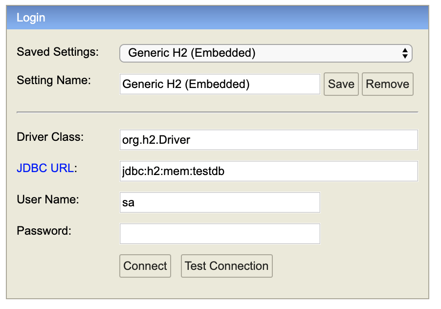
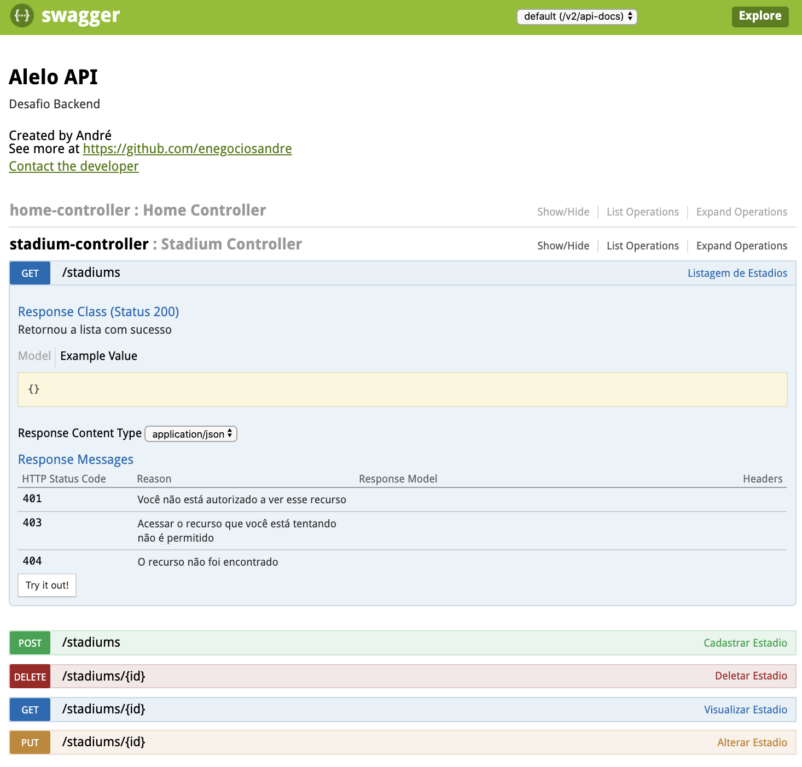

# Desafio Alelo solicitado 24/10/2019 para André Luiz Rosa

[](https://travis-ci.org/enegociosandre/desafio-andre)

Desafio para avaliação dos seus conhecimentos técnicos, que precisa ser concluído em até 3
dias (através da disponibilização do código fonte em qualquer repositório da WEB):
Criar uma API (tema livre) com:

* Get/Post/Delete/Put;
* Testes unitários, usando banco em memória;
* Teste “mockando” o retorno de uma API de terceiros;
* Documentação via Swagger;

Caso você não domine algum item do desafio proposto, não desista: envie tudo o que você
sabe. O objetivo é avaliar o seu jogo de cintura, seu nível de conhecimento e a sua criatividade.
A API deve ser simples, objetiva e aplicar boas práticas de desenvolvimento. 

#### Criar uma API (tema livre) com:
###### Get/Post/Delete/Put;

O tema livre que eu escolhi foi, criar uma API para expor informações, sobre restaurantes dentro de estádios, receber dados do número de estabelecimentos credenciados com Alelo, nos estádios Brasileiros que possuem restaurantes.

Com essa informação sendo atualizada periodicamente através da API, os setores de publicidade e vendas, poderiam consumir a API para fazerem analises e selecionarem estádios para fazerem campanhas de marketing com maior chance de retorno.

A API segue um tema comum e é bem simples como citado no texto do desafio. Mas nada impede que outras APIs com características financeiras mais aprimoradas também possar ser desenvovidas e publicadas para avaliação.


## Para executar o projeto você precisa:


######[Java 1.8](http://www.oracle.com) (http://www.oracle.com)

######[Maven](https://maven.apache.org/) (https://maven.apache.org/)


```sh
git clone https://github.com/enegociosandre/desafio-andre.git
cd desafio-andre
mvn clean install
mvn spring-boot:run
```

## Banco de dados em memória

* H2 - [Mais informações] (https://www.h2database.com/)

Para Rodar na API

```browser
http://localhost:8080/h2-database
```



```browser
Driver Class: org.h2.Driver
JDBC URL: jdbc:h2:mem:testdb
User Name: sa
Password:
```

## Documentação via Swagger

Swagger [Mais Informações] (https://swagger.io/)

Para Rodar na API


```browser
http://localhost:8080/swagger-ui.html/
```



## Gerenciador de dependências

* [Maven](https://maven.apache.org/) - Dependency Management

## Versioning

We use [GitHub](http://github.com) for versioning.

## Authors

* * Created by* - **André Rosa** - [enegocios.andre@gmail.com](https://github.com/enegocios.andre)

### Contributing
Pull requests are welcome.

## Other possible future features

* Multi-language api
* Pagination
* Filtering
* OAuth2
* JWT 
* what would you suggest?!# desafio-andre
